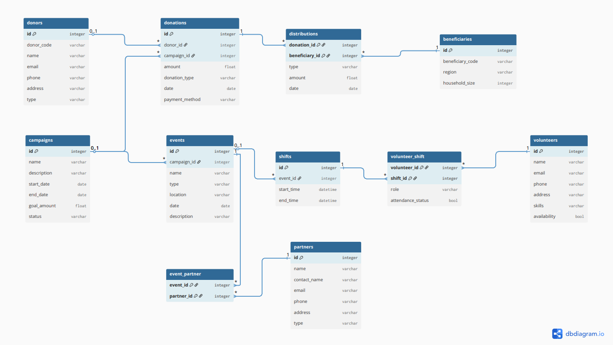

# Charity Operations Management Database

A relational database project that models core operations of a charity organization: donors & donations, campaigns & events, beneficiary distributions, volunteers & shift scheduling, and partners.

> **Data Notice:** All data used in this project is **synthetic** and created for academic/demo purposes only.

## Problem & Context
Small-to-mid charity teams often track operations across spreadsheets, forms, email, and chat. This creates:
- duplicate donor/beneficiary records
- weak traceability (donation → campaign → distribution → beneficiary)
- scheduling conflicts (volunteers/shifts)
- reporting gaps (funds raised, volunteer engagement, beneficiaries served)

## Why a Relational Database?
This domain involves multiple entities and relationships (donors–donations, campaigns–events, events–shifts, volunteers–shifts, distributions–beneficiaries, partners–events).
SQL supports integrity via PK/FK constraints and enables reporting using joins and aggregation.

## Project Artifacts
- **SQL schema + synthetic inserts:** `sql/charity_db.sql`
- **Entity-Relationship Model (ERM):** `docs/ERM.pdf`
- **Project proposal:** `docs/Project_Proposal.pdf`
- **Poster:** `poster/poster.pptx`

## Schema Overview (Tables)
Core tables include:
- `donors`, `donations`, `campaigns`, `events`
- `beneficiaries`, `distributions`
- `volunteers`, `shifts`, `volunteer_shift`
- `partners`, `event_partner`

## ERD


## Setup (MySQL/MariaDB)
1. Open MySQL/MariaDB client (or phpMyAdmin / DBeaver)
2. Run the script:
   - `sql/charity_db.sql`

This script:
- creates the database
- creates all tables (PK/FK constraints)
- inserts synthetic sample data

## Example Queries
**Campaign totals**
```sql
SELECT c.name AS campaign_name, COALESCE(SUM(d.amount),0) AS total_raised
FROM campaigns c
LEFT JOIN donations d ON c.id = d.campaign_id
GROUP BY c.id, c.name
ORDER BY total_raised DESC;
